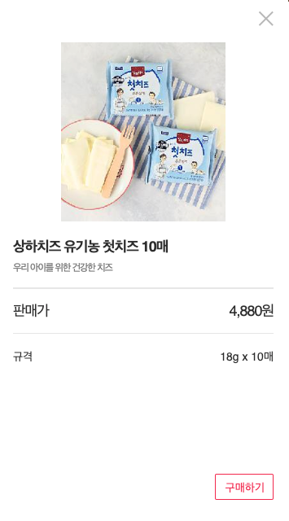

# Attractt 고급설정 API 연동

### 단일 상품 정보

- **단일 상품에 대한 `상세 정보`를 내려주는 API로 개발해주시면 됩니다.**

- **API 주소는 특정한 형식없이 없습니다.**

- **응답값은 `JSON` 형태로 내려주세요.**

  - 예시

    > 상하농원 : /product/detail.jsp?pid=`{product_id}`
    >
    > 뉴발란스 : /StyleList.svc/ProdDetail/id=`{product_id}`
    >
    > 폴더 : /StyleList.svc/`{product_id}`

<br>

- **Request**

  > **(GET)** {단일 상품 정보 API 주소}

- **Response**

  ```js
  callbackFunctionName({
    "id": "상품 고유번호",
    "name": "상품명",
    "image": [
      "상품 이미지1.jpg",
      "상품 이미지2.jpg",
      ...
    ],
    "price": "판매가",
    "discount": "할인가격",
    "unit": "중량/용량",
    "explain": "간략 상품설명",
    "link": "해당상품 페이지 주소",
    "cart": "장바구니 링크"
  })
  ```


- cart, link: 는 각각 '장바구니' 버튼, '구입하기' 버튼으로 문구가 다른 차이가 있습니다.

<br>


## Response Example

```json
callbackName({
	"id" : "A0001124",
	"name" : "상하치즈 유기농 첫치즈 10매",
	"thumb" : "http://www.sanghafarm.co.kr/sanghafarm_Data/upload/shop/product/201911/A0001124_2019112712562930826.jpg",
	"image" : [
		"http://www.sanghafarm.co.kr/sanghafarm_Data/upload/shop/product/201911/A0001124_2019112712562930825.jpg",
		"http://www.sanghafarm.co.kr/sanghafarm_Data/upload/shop/product/201911/A0001124_2019112712562930827.jpg"
	],
	"price" : "4880",
	"unit" : "18g x 10매",
	"explain" : "우리 아이를 위한 건강한 치즈",
	"link" : "http://www.sanghafarm.co.kr/product/detail.jsp?pid=A0001124"
})

```

- 현재 thumb 항목만 넘기는 거와 image 배열로 넘기는 것 둘 다 같은 동작을 하고 있습니다. 둘 중 편한 방법으로 넘겨 주시면 됩니다.





아래 링크의 첫번째 사진을 통해 적용 예시를 확인 하실 수 있습니다.

https://www.attractt.com/embed/preview?code=JVI3tRyslO8USys&type=grid 

### * 주의사항

- **SSL 적용**

  어트랙트는 개인정보를 활용하는 사이트로 SSL(https 프로토콜)이 적용되어 있습니다. 따라서 API 호출 또한 SSL이 적용된 주소로만 가능합니다. 서비스 전체에 SSL 적용이 어려우시다면 특정 포트만 허용하여 주소를 전달하여 주시기 바랍니다.

- **크로스도메인 에러 방지를 위한 콜백 파라미터 작업**

  어트랙트측에서 데이터를 요청할 때 크로스도메인(CORS)을 방지하기 위해서 `callback=?` 파라미터를 붙여서 요청을 합니다. 서버에서 요청을 받으실 때 `callback` 파라미터 함수명을 받아 응답값을 감싸서(상단 **Response**의 `callbackFunctionName`) 내려주시면 됩니다.

  
